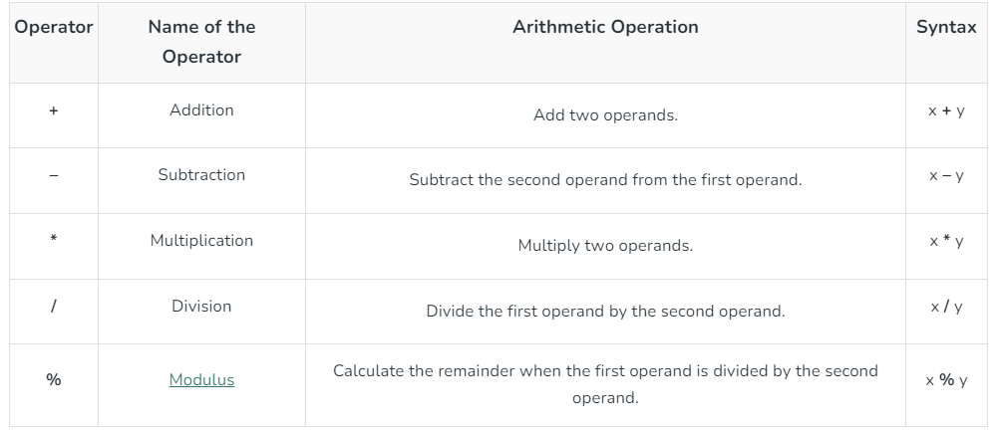

---

## Aritmethic Operators - Binary Operators
This operators need two elements to execute.



## Aritmethic Operators - Unary Operators
This operators need only _one_ element to execute.

- Unary increment operator x++   Equivalent to  x = x+1
- Unary decrement operator x--   Equivalent to  x = x-1

But both the increment and decrement operator can appear on either side of an expression:

_Pre-incrementing_
```C++
uint32_t x,y;
x = 5;
y = ++x;
```
_result_
```C++
y = 6, x =6
```
Here the variable `x` is frist incremented and then evaluated.

_Post-incrementing_
```C++
uint32_t x,y;
x = 5;
y = x++;
```
_result_
```C++
y = 5, x =6
```
Here the variable `x` is first evaluated and then incremented, that's why the `y` variable has the initial value of `x` instead of the incremented one.
