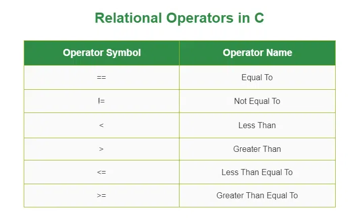

---

Relational operators do some kind of evaluation on the operands and then return value 1 (TRUE) or 0 (FALSE).

Relational operators are binary operators because they require two operands to operate.

The relational operators are evaluated left to right.

