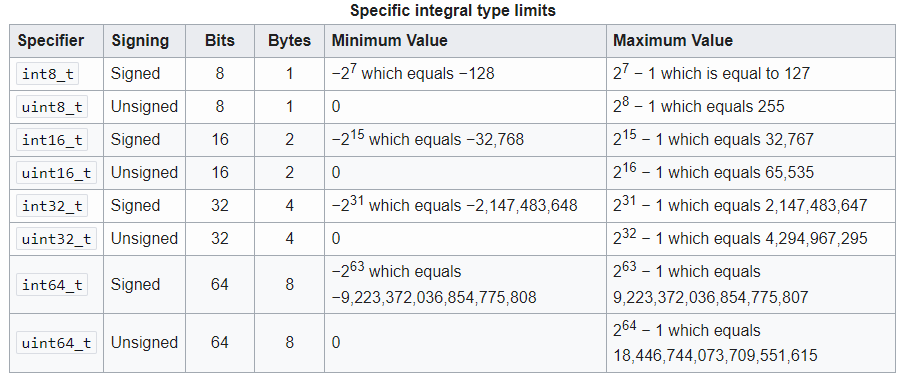

---
### Portability issues

Data types may cause portability issues of code when compiler changes.

One compiler may consider the `integer` data type as **2 bytes**, another compiler may consider it as **4 bytes** or even **8 bytes.**

---

In the "C" programming language the most commmonly used data types `int` and `long` casue portability issues. This is because the storage size for `int` and `long` type are not defined within the C standard (C90 or C99).

The compiler vendors have the choice to define the storage size for the variable depending solely on hardware capabilities of the target platform, with respect to the minimum widths defined by the standard.

To avoid this, we need to make use of data types where their size is explicit in their name. So we know exactly how much data is being allocated for each variable.

---

The `stdint.h` header defines integer types with specified widths. It provides sets of typedefs for exact-width integer types, along with defined minimum and maximum allowable values for each type. These types are useful for writing more portable code. [^1]

[^1]: https://en.wikibooks.org/wiki/C_Programming/stdint.h